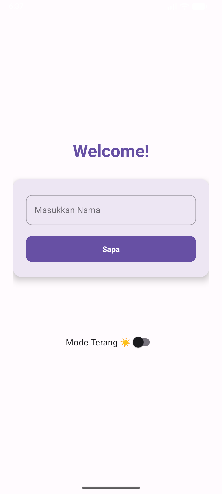
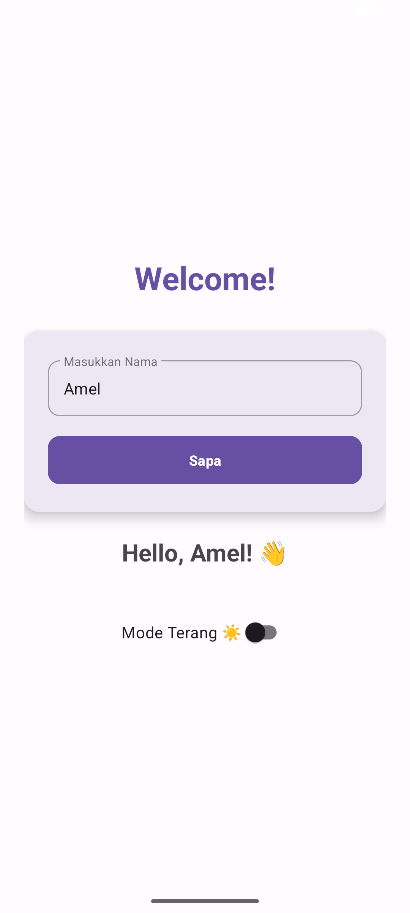
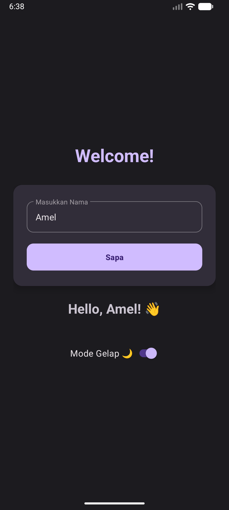

**Tugas Pemrograman Mobile**

| **Nama** | [Rabiah Riska Amaliah] |
| **NIM** | [2410817320010] |

## 📱 Deskripsi Singkat
Aplikasi Android sederhana yang dikembangkan menggunakan **Kotlin** dan **XML**. Aplikasi ini berfungsi untuk menyapa pengguna berdasarkan input nama yang diberikan.

## ✨ Fitur Utama
1.  **Input Nama:** Validasi input tidak boleh kosong.
2.  **Sapaan Personal:** Menampilkan teks "Hello, [Nama]! 👋".
3.  **Tema Ganda:** Switch untuk mengubah Mode Gelap (Dark) dan Terang (Light).

## 🚀 Cara Menjalankan (How to Run)

### Persiapan
Pastikan kamu sudah menginstal **Android Studio** dan memiliki koneksi internet untuk mengunduh dependencies (Gradle).

### Langkah-langkah
1.  **Clone atau Download** repository ini.
    ```bash
    git clone [https://github.com/username-kamu/nama-repo.git](https://github.com/username-kamu/nama-repo.git)
    ```
    *(Atau download file ZIP dan ekstrak)*

2.  Buka **Android Studio**.
3.  Pilih menu **File** -> **Open...** lalu arahkan ke folder project ini.
4.  Tunggu hingga proses **Gradle Sync** selesai (biasanya ada bar loading di bawah kanan).
5.  Hubungkan HP Android (via kabel USB/Debugging) atau nyalakan **Emulator**.
6.  Klik tombol **Run 'app'** (ikon Play hijau ▶️) di toolbar atas atau tekan `Shift + F10`.

## Screenshot Aplikasi





